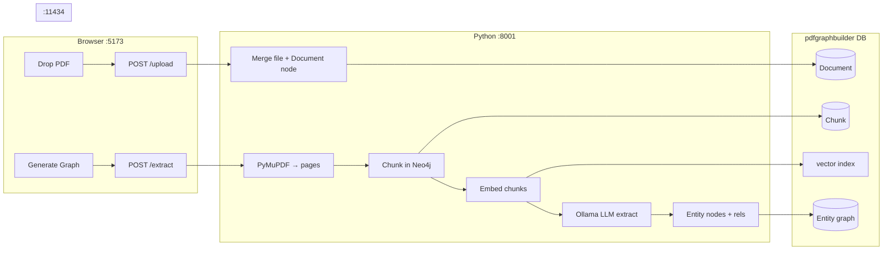

# Design: PDF Graph Builder (local)

Domain-agnostic project to ingest unstructured documents (PDFs first) and build a **structured knowledge graph** in Neo4j using **Neo4j’s LLM Knowledge Graph Builder**—not a custom ingest script.

This folder captures intent, architecture, and local workflow for a **spinoff** from [Neo4j-AutoMechanic-SME](../). The upstream Graph Builder app is cloned and running in this repo.

**Working name:** `pdf-graph-builder` (or `neo4j-doc-graph-builder`) — no subject-matter domain in the name.

---

## Product decision: this implementation

**This project builds graphs from documents.**

The primary capability:

> *Take PDFs (and later other sources), extract entities and relationships with an LLM, and store them in Neo4j for exploration and Q&A.*

It answers a different question than the parent **Auto Mechanic SME** repo:

| | **Neo4j-AutoMechanic-SME** (parent) | **This spinoff** |
|---|---|---|
| **Primary goal** | Diagnostic Q&A (symptom → cause → fix) | Document → knowledge graph |
| **Structured graph** | Hand-authored seed (`seed_data.py`) | LLM-extracted entities + relations |
| **PDF handling** | Chunk + embed only (`Document` RAG) | Chunk + embed **and** entity extraction |
| **App** | Custom FastAPI + Rex chat UI | Neo4j Labs Graph Builder UI |
| **Domain** | Auto mechanics (for now) | **Domain-agnostic** |
| **Docker** | Not used | **Not used** |

The two projects may share **Neo4j Desktop** and **Ollama** on the same machine but should use **separate Neo4j databases** to avoid colliding `Document` / chunk schemas and extraction noise.

---

## What Graph Builder does (upstream product)

[Neo4j LLM Knowledge Graph Builder](https://neo4j.com/labs/genai-ecosystem/llm-graph-builder/) is an open-source Neo4j Labs application:

- **Repo:** https://github.com/neo4j-labs/llm-graph-builder  
- **Hosted demo:** https://llm-graph-builder.neo4jlabs.com/ (optional; local deploy preferred here)

**Pipeline:**

1. Ingest source (PDF, text, web, etc.) → `Document` node  
2. Chunk text → `Chunk` nodes, linked to document (and each other for advanced RAG)  
3. Embed chunks → vector index in Neo4j  
4. LLM extracts **entities and relationships** from chunks → entity graph linked to source chunks  
5. Chat modes: vector, graph, graph+vector, hybrid, etc.

Uses LangChain loaders and Neo4j’s `llm-graph-transformer` patterns. Optional **extraction schema** (node/relationship labels) in the UI.

**This spinoff** is a local deployment and workflow around that product—not a reimplementation.

---

## Runtime stack (this project)

| Component | Approach |
|---|---|
| **Graph Builder backend** | Python 3.12+ venv → `uvicorn score:app --reload` in cloned `backend/` |
| **Graph Builder frontend** | `yarn` → `yarn run dev` in cloned `frontend/` |
| **Neo4j** | **Neo4j Desktop** — dedicated database for extracted graphs |
| **Neo4j version** | **5.23+** (required by Graph Builder backend Cypher) |
| **APOC** | Installed and allowed (same as parent SME project) |
| **LLM** | **Ollama** on host (`http://localhost:11434`) — Homebrew install, not Ollama-in-Docker |
| **Shell** | **bash** on macOS |
| **Docker** | **Not used** — per upstream README: *docker-compose is not supported with Neo4j Desktop*; run backend + frontend separately |

### Port conflict

Graph Builder’s backend defaults to **port 8000**. The parent SME app also uses **8000**. This project uses **8001** (`VITE_BACKEND_API_URL` in `frontend/.env`). Run only one backend at a time on a given port.

---

## Two layers of knowledge (domain-agnostic framing)

Any domain splits into complementary layers. Stay aware of the distinction when defining extraction schema:

### 1. Structure (anatomy / ontology)

What exists, how it is organized, what contains what.

Examples (domain-dependent): `Part → Assembly → System`, `Concept → Subtopic → Chapter`, `Actor → Team → Organization`.

Typical edges: `PART_OF`, `CONTAINS`, `LOCATED_IN`, `MEMBER_OF`.

### 2. Activity (behavior / process)

What happens, what causes what, how problems are resolved.

Examples: `Fault → Symptom → Procedure`, `Event → Consequence → Mitigation`, `Requirement → Test → Pass/Fail`.

Typical edges: `CAUSES`, `IMPLIES`, `RESOLVED_BY`, `REQUIRES`, `PRECEDES`.

**Graph Builder** may blur these unless you configure **entity extraction schema** deliberately. Free-form extraction produces whatever labels the LLM invents—plan for cleanup, deduplication, and optional merge into a curated ontology later.

### One graph or two?

| Approach | When |
|---|---|
| **One graph, two relationship families** | Default; shared entity nodes bridge structure and activity |
| **Two databases** | Separate “ontology browser” vs “process/diagnostic” products |
| **Extract then MERGE into curated schema** | SME-style hand graph + document-derived extensions |

For this spinoff, start with **one Graph Builder database** and refine schema in the UI before splitting.

---

## PDF ingest: documents vs structured graph

### Parent SME project (for contrast)

`scripts/ingest_pdf.py` in the parent repo:

- Chunks + embeds only  
- `Document` nodes for **RAG**  
- Does **not** create `Component` / `Symptom` / etc. nodes  

### This spinoff

Graph Builder does **both**:

| Output | Purpose |
|---|---|
| `Document` + `Chunk` + embeddings | Semantic search, citations |
| **Entity nodes + relationships** | Graph traversal, structured Q&A, Browser exploration |

### Content suitability

| Content type | RAG (chunks) | Graph extraction |
|---|---|---|
| Code / ID lists with definitions | ✓ | ✓✓ |
| Tables: X → Y → Z (troubleshooting, flows) | ✓ | ✓✓ |
| Procedures with tools, steps, prerequisites | ✓ | ✓ |
| Hierarchical catalogs / taxonomies | ✓ | ✓ |
| Long narrative prose | ✓✓ | ✗ (noisy triples) |
| Scanned image-only PDFs | ✗ until OCR | ✗ |
| Diagrams / wiring as images | ✗ as text | ✗ (needs specialized parsing) |

Use **selectable-text PDFs**. OCR first (e.g. `ocrmypdf`) if needed.

---

## PDF ingest pipeline (local setup)

Graph Builder splits work into **upload** (register the file) and **extract** (chunk → embed → LLM graph). Upload happens when you add a file in the UI; extract runs when you click **Generate Graph**.



### Phase 1 — Upload (left panel)

1. **Frontend** sends the file (in HTTP chunks for large files) to `POST /upload`.
2. **Backend** writes parts under `backend/chunks/`, merges into `backend/merged_files/`.
3. **Neo4j** gets a **`Document`** node (filename, size, source=`local file`, model, status `New`).

No extraction yet — only file storage and registration.

### Phase 2 — Extract (Generate Graph)

Frontend calls `POST /extract` with settings from the UI and `.env`:

| Setting | This project |
|---|---|
| LLM | `ollama_llama3_2` → Ollama `llama3.2` |
| Embeddings | `all-MiniLM-L6-v2` (Sentence Transformers, 384-dim) |
| Database | `pdfgraphbuilder` |
| Batch size | 20 chunks per LLM pass (`UPDATE_GRAPH_CHUNKS_PROCESSED`) |

**Steps inside extract:**

1. **Read PDF** — PyMuPDF (`local_file.py`) loads page text into LangChain documents. Image-only/scanned PDFs fail here.
2. **Chunk** — Token-sized splits (size/overlap from Graph Settings). Each chunk becomes a **`Chunk`** node:
   - `(:Chunk)-[:PART_OF]->(:Document)`
   - `(:Chunk)-[:FIRST_CHUNK]->(:Chunk)` on the first chunk
   - `(:Chunk)-[:NEXT_CHUNK]->(:Chunk)` for reading order
   - Chunk `id` is a content hash.
3. **Embed** — Vector index on `Chunk.embedding`; Sentence Transformers writes 384-dim vectors (RAG / vector chat).
4. **LLM extract** — In batches, combined chunks go to Ollama via LangChain `LLMGraphTransformer`:
   - Entity nodes MERGE’d with `apoc.merge.node`
   - `(:Chunk)-[:HAS_ENTITY]->(entity)` links extractions to source text
   - Optional **extraction schema** in the UI constrains labels and `(source, REL, target)` patterns; without it the LLM invents labels freely.
5. **Status** — `Document` updated to `Completed` with node/relationship counts.

### What lands in Neo4j

| Layer | Nodes | Key relationships | Used for |
|---|---|---|---|
| Document RAG | `Document`, `Chunk` | `PART_OF`, `NEXT_CHUNK`, `FIRST_CHUNK` | Semantic search, citations |
| Entity graph | LLM-created labels | LLM rels + `HAS_ENTITY` from chunks | Graph traversal, structured Q&A |
| Vectors | property on `Chunk` | vector index | Similarity search |

Verify in Browser:

```cypher
:use pdfgraphbuilder
MATCH (d:Document)<-[:PART_OF]-(c:Chunk)-[:HAS_ENTITY]->(e)
RETURN d.fileName, count(DISTINCT c), count(DISTINCT e);
```

### Optional post-processing (Graph Settings)

Not automatic on first ingest unless enabled:

- Chunk similarities (`SIMILAR` between chunks)
- Full-text / hybrid indexes
- Entity embeddings (entity-vector chat mode)
- Communities (requires GDS — off in current Desktop setup)

### Chat after ingest

| Mode | Uses |
|---|---|
| `vector` | Chunk embeddings only |
| `graph` | Cypher over entity graph |
| `graph_vector` | Both |

All grounded in `pdfgraphbuilder` — same chunks and entities from the PDF.

### Tuning levers

- **Extraction quality:** selectable-text PDFs; define schema (structure vs activity labels); start with short, structured docs.
- **Speed:** Ollama on a laptop is the bottleneck; smaller PDFs, fewer chunks.
- **Schema framing:** see [Two layers of knowledge](#two-layers-of-knowledge-domain-agnostic-framing) above.

---

## Deployment: local without Docker

1. Clone https://github.com/neo4j-labs/llm-graph-builder  
2. Create a **new database** in Neo4j Desktop  
3. Configure `backend/.env` from `backend/example.env` (Neo4j URI, credentials, Ollama model keys)  
4. Configure `frontend/.env` from `frontend/example.env` (`VITE_BACKEND_API_URL`, `VITE_SKIP_AUTH`, chat modes, Ollama in model list)  
5. Start backend and frontend in separate terminals  
6. Upload PDFs → Generate Graph → explore in UI / Bloom / Browser  

Do **not** rely on `docker-compose` for Neo4j Desktop workflows. Do **not** run Ollama in Docker if it is already installed via Homebrew.

---

## Relationship to parent SME repo

| Integration | Recommendation |
|---|---|
| **Same machine** | Fine — shared Neo4j Desktop + Ollama |
| **Same Neo4j database** | **Avoid** — schema and `Document` chunk collisions |
| **Merge repos** | Only if explicitly chosen; keep concerns separated in docs |
| **Feed SME from extracted graph** | Future: ETL / MERGE extracted triples into diagnostic schema with review |

Parent design notes: [../docs/DESIGN.md](../docs/DESIGN.md)

---

## Success criteria

- [x] Graph Builder UI running locally (backend + frontend, no Docker)  
- [x] Connected to a **dedicated** Neo4j Desktop database (5.23+, APOC) — `pdfgraphbuilder`  
- [x] Ollama used for extraction (embeddings: Sentence Transformers locally)  
- [ ] At least one PDF ingested with **visible entity nodes and relationships** in Neo4j Browser (not chunks alone)  
- [ ] Chat in graph or hybrid mode returns grounded answers  
- [ ] Short notes on schema chosen, models used, and quality of extraction  

---

## Out of scope (initially)

- Docker / docker-compose deployment  
- Domain-specific seed graphs (that is the parent SME or a downstream consumer)  
- Custom FastAPI chat app (use Graph Builder UI first)  
- Pirated or bulk-scraped document packs  
- Automatic merge into parent SME without human review  

---

## Possible future work

- Programmatic pipeline via `neo4j-graphrag` `SimpleKGPipeline` (graduate from UI-only)  
- Extraction schema templates per domain (without renaming this repo)  
- Entity resolution and deduplication post-processing  
- Link `Chunk` nodes to curated ontology nodes (`[:SUPPORTS]` / `[:MENTIONS]`)  
- Optional ETL into application-specific graphs (e.g. parent SME diagnostic schema)  

---

## References

| Resource | URL |
|---|---|
| Graph Builder product page | https://neo4j.com/labs/genai-ecosystem/llm-graph-builder/ |
| GitHub | https://github.com/neo4j-labs/llm-graph-builder |
| Parent SME design | [../Neo4j-AutoMechanic-SME/docs/DESIGN.md](../Neo4j-AutoMechanic-SME/docs/DESIGN.md) |
| SME vs generic SME, curation roles | [docs/sme-and-kg-roles.md](docs/sme-and-kg-roles.md) |
| Bootstrap prompt | [prompt.md](prompt.md) |
