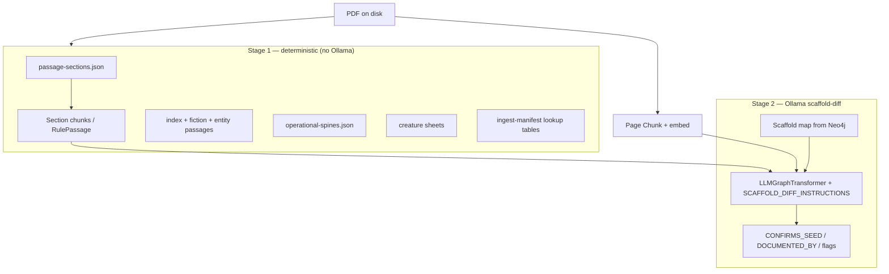
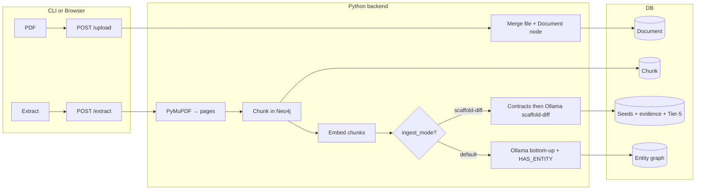

# Design: PDF Graph Builder (local)

Ingest unstructured documents (PDFs first) into a **structured knowledge graph** in Neo4j. The repo started as a local spinoff of [Neo4j’s LLM Knowledge Graph Builder](https://neo4j.com/labs/genai-ecosystem/llm-graph-builder/); the **product path** for rulebook work (Mörk Borg ↔ AI-DM-Assistant) is **contract-first materialization**, then a **narrow Ollama scaffold-diff** pass—not free-form LLM invent-the-schema extraction.

**Working name:** `pdf-graph-builder` — no subject-matter domain in the name.

Agent ops for tables/sections: [`AGENTS.md`](AGENTS.md). Product README (Use Case 2): [`README.md`](README.md).

---

## Product decision: this implementation

**This project builds graphs from documents**, with two ingest philosophies in one codebase:

| Mode | Role | Ollama? |
|---|---|---|
| **Upstream / bottom-up** | Classic Graph Builder: chunk → embed → LLM invents entities → `HAS_ENTITY` | Yes (primary) |
| **Product / scaffold-diff** | Dress a pre-bootstrapped seed ontology with PDF evidence; deterministic contracts first | Yes, **only** for seed confirmation from prose |

Primary product capability today:

> *Against a companion scaffold in Neo4j, run operator-maintained JSON contracts (passages, catalogs, tables, spines, sheets) from the PDF on disk, then use Ollama to confirm seeds from chunk prose (`CONFIRMS_SEED` / `DOCUMENTED_BY`).*

| | **Neo4j-AutoMechanic-SME** (parent) | **This repo (product path)** |
|---|---|---|
| **Primary goal** | Diagnostic Q&A | Document → graph against a curated scaffold |
| **Structured graph** | Hand-authored seed | ADA/bootstrap seeds + pgb contracts + LLM evidence |
| **PDF handling** | Chunk + embed | Chunk + embed + **deterministic materializers** + scaffold-diff LLM |
| **App** | Custom FastAPI + chat | Graph Builder API/UI **plus** PowerShell CLIs (`ingest-morkborg.ps1`, `ingest-tables.ps1`, `materialize-*`) |
| **Domain** | Auto mechanics | Domain-agnostic core; **Mörk Borg** is the first full contract pack |
| **Docker** | Not used | **Not used** |

Companion **AI-DM-Assistant (ADA)** owns seeds/bootstrap/retrieval; **pdf-graph-builder** owns Tier-5 contracts and materialization. Share Neo4j Desktop + Ollama on one machine if needed, but use **separate databases** so `Document` / chunk schemas do not collide.

---

## What Graph Builder does (upstream product)

[Neo4j LLM Knowledge Graph Builder](https://neo4j.com/labs/genai-ecosystem/llm-graph-builder/) is an open-source Neo4j Labs application:

- **Repo:** https://github.com/neo4j-labs/llm-graph-builder  
- **Hosted demo:** https://llm-graph-builder.neo4jlabs.com/ (optional; local deploy preferred here)

**Upstream pipeline (bottom-up):**

1. Ingest source (PDF, text, web, etc.) → `Document` node  
2. Chunk text → `Chunk` nodes, linked to document (and each other for advanced RAG)  
3. Embed chunks → vector index in Neo4j  
4. LLM extracts **entities and relationships** from chunks → entity graph linked via `HAS_ENTITY`  
5. Chat modes: vector, graph, graph+vector, hybrid, etc.

Uses LangChain loaders and Neo4j’s `llm-graph-transformer` patterns. Optional **extraction schema** (node/relationship labels) in the UI.

**This repo** still runs that stack for bottom-up experiments. **Rulebook / ADA work uses scaffold-diff** (next section)—same `POST /upload` + `POST /extract` API, different `ingest_mode` and a large deterministic prelude.

---

## Product path: contracts first, Ollama second

### Two stages (do not conflate)

| Stage | What | Needs Ollama? |
|---|---|---|
| **1. Contracts** | Operator JSON + Python materializers cut PDF text into passages, catalogs, lookup tables, operational spines, creature sheets | **No** |
| **2. Scaffold-diff LLM** | Ollama + LangChain `LLMGraphTransformer` reads selected chunks and confirms / documents / flags against the seed map | **Yes** |

**Contracts are the recipe.** They do not call the LLM. Typical files under `games/<game>/`:

| Contract | Role |
|---|---|
| `ingest-manifest.json` | Lookup tables, passage-sections pointer, rulebook index hooks |
| `passage-sections.json` | Section cuts, index titles, entity-passage bounds, `seed_evidence` |
| `operational-spines.json` | Altitude / DR / circumstance spines |
| Hand-authored overrides | Tables that cannot be PDF-parsed cleanly |

**Ollama’s job is narrow:** given chunk prose and a scaffold map (labels + seed IDs), emit extractions that post-processing turns into evidence edges—chiefly `CONFIRMS_SEED` and `DOCUMENTED_BY`—not invent a new ontology. It does **not** replace table parsers, section cutters, or spine/sheet materializers.

### Where the LLM prompt lives

| Piece | Location |
|---|---|
| Scaffold-diff system instructions | `SCAFFOLD_DIFF_INSTRUCTIONS` in [`backend/src/shared/constants.py`](backend/src/shared/constants.py) |
| Wiring | [`backend/src/llm.py`](backend/src/llm.py) — on `ingest_mode=scaffold-diff`, formats that string with scaffold labels/seed IDs and passes it as `additional_instructions` into `LLMGraphTransformer` (on top of LangChain’s built-in graph-extract prompt) |
| Allowed ingest rel types | `INGEST_REL_TYPES` in the same constants file; `SPECIALIZES` is bootstrap-only (`SCAFFOLD_ONLY_REL_TYPES`) |
| Persist path | `save_scaffold_diff_in_neo4j` (not the bottom-up `HAS_ENTITY` writer) |

Bottom-up mode still uses `ADDITIONAL_INSTRUCTIONS` and writes `(:Chunk)-[:HAS_ENTITY]->(entity)`. Scaffold-diff **does not** create `HAS_ENTITY`; it uses `DOCUMENTED_BY` / `CONFIRMS_SEED` (and related ingest signals). See README Use Case 2 for the full signal table.

### Full extract order (`ingest_mode=scaffold-diff`)

Product entry: `.\ingest-morkborg.ps1` → `.\ingest-pdf.ps1` → `POST /upload` + `POST /extract` with `ingest_mode=scaffold-diff` and `section_phase` (wrappers default **2**).

`section_phase` **is** the ADA coverage-phase integer (include `phase <= N`; `>= 2` also emits spines + sheets). It is not a slice id (`2a`–`2g`) and not product Phase 0–5. Semantics: ADA `DESIGN.md` §4.5.1. Backend omit still defaults to **1**.

Inside extract ([`backend/src/main.py`](backend/src/main.py)), after PDF read / page chunks:

1. **Fetch scaffold map** from Neo4j (nodes with `tier` / `seed_id`). Fail if empty—bootstrap first (ADA).
2. **Materialize passage sections** (`passage-sections.json`, phase ≤ `section_phase`).
3. **Rulebook catalog** (index + fiction instances + entity passages).
4. If `section_phase >= 2`: **operational spines**, then **creature sheets**.
5. **Lookup-table pipeline** — PDF on disk → parse per manifest → Neo4j (`run_lookup_table_pipeline`). Neo4j is the sink, never the table text source.
6. **Build LLM chunk list** — section chunks (eligible for seed evidence) + filtered page chunks.
7. **Ollama batches** — scaffold-diff save path; then **coverage propagation** (`research-only` → `ingest-confirmed` when `CONFIRMS_SEED` exists).


```mermaid
flowchart TB
  subgraph Contracts["Stage 1 — deterministic (no Ollama)"]
    A[passage-sections.json] --> B[Section chunks / RulePassage]
    C[index + fiction + entity passages]
    D[operational-spines.json]
    E[creature sheets]
    F[ingest-manifest lookup tables]
  end
  subgraph LLM["Stage 2 — Ollama scaffold-diff"]
    G[Scaffold map from Neo4j]
    H[LLMGraphTransformer + SCAFFOLD_DIFF_INSTRUCTIONS]
    I[CONFIRMS_SEED / DOCUMENTED_BY / flags]
  end
  PDF[PDF on disk] --> Contracts
  PDF --> Chunks[Page Chunk + embed]
  B --> H
  Chunks --> H
  G --> H
  H --> I
```

### Entry points: full ingest vs light CLIs

| Path | Entry | Runs Stage 1 | Runs Stage 2 (Ollama) | When |
|---|---|---|---|---|
| **Full product ingest** | `.\ingest-morkborg.ps1` / `POST /extract` `scaffold-diff` | Yes (all of the above for the phase) | **Yes** | After DB reset, or whenever seed evidence + Completed `Document` are required |
| **Tables only** | `.\ingest-tables.ps1` | Lookup tables (+ bundles) | No | Iterate table contracts without paying for LLM |
| **Sections / index / spines / sheets** | `materialize-passage-sections.ps1`, `materialize-rulebook-index.ps1`, and related Python CLIs | That slice only | No | Dev / recovery / briefing fill when LLM evidence is already present or not needed |

Light CLIs are **correct** to skip Ollama: they are not a stealth bypass of LLM work. The ops mistake is treating them as a substitute for full ingest **after a reset**—you get dressed contracts without a Completed document and without `CONFIRMS_SEED` fan-out from prose.

The Graph Builder **drag-drop UI** is not a third architecture: it hits the same upload/extract API. Prefer contract-first CLI wrappers for Mörk Borg so settings (`ingest_mode`, `section_phase`) stay explicit.

### Boundary: JSON contracts, not Python hardcodes

Chunk/passage spans and table cuts are operator-maintained JSON (`start_anchor` / `end_anchor`, `entity_passage.stop_before`, lookup `pdf_extract.stop_before`). Amend JSON after a PDF pass; re-materialize. Field guide: `games/mork-borg/README.md`. Do not copy contracts into ADA.

---

## Runtime stack (this project)

| Component | Approach |
|---|---|
| **Graph Builder backend** | Python 3.12+ venv → `uvicorn score:app --reload` in cloned `backend/` |
| **Graph Builder frontend** | `yarn` → `yarn run dev` in cloned `frontend/` |
| **Neo4j** | **Neo4j Desktop** — dedicated database for extracted graphs |
| **Neo4j version** | **5.23+** (required by Graph Builder backend Cypher) |
| **APOC** | Installed and allowed (same as parent SME project) |
| **LLM** | **Ollama** on host (`http://localhost:11434`) — Homebrew install, not Ollama-in-Docker |
| **Shell** | PowerShell wrappers at repo root (`ingest-morkborg.ps1`, `ingest-tables.ps1`, …); bash also fine |
| **Docker** | **Not used** — per upstream README: *docker-compose is not supported with Neo4j Desktop*; run backend + frontend separately |

### Port conflict

Graph Builder’s backend defaults to **port 8000**. The parent SME app also uses **8000**. This project uses **8001** (`VITE_BACKEND_API_URL` in `frontend/.env`). Run only one backend at a time on a given port.

---

## Two layers of knowledge (domain-agnostic framing)

Any domain splits into complementary layers. Stay aware of the distinction when defining extraction schema:

### 1. Structure (anatomy / ontology)

What exists, how it is organized, what contains what.

Examples (domain-dependent): `Part → Assembly → System`, `Concept → Subtopic → Chapter`, `Actor → Team → Organization`.

Typical edges: `PART_OF`, `CONTAINS`, `LOCATED_IN`, `MEMBER_OF`.

### 2. Activity (behavior / process)

What happens, what causes what, how problems are resolved.

Examples: `Fault → Symptom → Procedure`, `Event → Consequence → Mitigation`, `Requirement → Test → Pass/Fail`.

Typical edges: `CAUSES`, `IMPLIES`, `RESOLVED_BY`, `REQUIRES`, `PRECEDES`.

**Bottom-up Graph Builder** may blur these unless you constrain labels. Free-form extraction invents labels freely—plan for cleanup. **Scaffold-diff** avoids that by locking labels to the ADA seed map and putting structure in JSON contracts.

### One graph or two?

| Approach | When |
|---|---|
| **One graph, two relationship families** | Default; shared entity nodes bridge structure and activity |
| **Two databases** | Separate “ontology browser” vs “process/diagnostic” products; also **pgb vs ADA** when sharing a machine |
| **Bootstrap scaffold + document evidence** | Product path: ADA seeds, pgb contracts + scaffold-diff |

Prefer **one database per product role** (scaffold + evidence together for a game), not splitting ontology and PDF evidence across DBs.

---

## PDF ingest: documents vs structured graph

### Parent SME project (for contrast)

`scripts/ingest_pdf.py` in the parent repo:

- Chunks + embeds only  
- `Document` nodes for **RAG**  
- Does **not** create `Component` / `Symptom` / etc. nodes  

### This repo

| Output | Purpose |
|---|---|
| `Document` + `Chunk` + embeddings | Semantic search, citations |
| **Contract materialization** | Passages, catalogs, tables, spines, sheets (deterministic) |
| **Scaffold-diff evidence** | `CONFIRMS_SEED` / `DOCUMENTED_BY` / flags (Ollama) |
| **Bottom-up entities** (optional mode) | Free LLM labels + `HAS_ENTITY` |

### Content suitability

| Content type | RAG (chunks) | Contract / table parse | LLM scaffold-diff |
|---|---|---|---|
| Code / ID lists with definitions | ✓ | ✓✓ | ✓ |
| Tables: X → Y → Z | ✓ | ✓✓ (manifest) | noisy if used alone |
| Procedures with tools, steps, prerequisites | ✓ | spines / sections | ✓ |
| Hierarchical catalogs / taxonomies | ✓ | rulebook index | ✓ |
| Long narrative prose | ✓✓ | section cuts | use sparingly |
| Scanned image-only PDFs | ✗ until OCR | ✗ | ✗ |
| Diagrams / wiring as images | ✗ as text | ✗ | ✗ |

Use **selectable-text PDFs**. OCR first (e.g. `ocrmypdf`) if needed.

---

## PDF ingest pipeline (API baseline)

Graph Builder splits work into **upload** (register the file) and **extract** (chunk → embed → graph). Upload happens when you add a file in the UI or via CLI; extract runs on **Generate Graph** or `POST /extract`.

For **Mörk Borg / ADA**, set `ingest_mode=scaffold-diff` and follow [Product path: contracts first, Ollama second](#product-path-contracts-first-ollama-second). The diagram below is the **shared shell**; scaffold-diff inserts Stage 1 materializers before the LLM step and changes what the LLM writes.


```mermaid
flowchart LR
  subgraph Client["CLI or Browser"]
    A[PDF] --> B["POST /upload"]
    C[Extract] --> D["POST /extract"]
  end
  subgraph Backend["Python backend"]
    B --> E[Merge file + Document node]
    D --> F[PyMuPDF → pages]
    F --> G[Chunk in Neo4j]
    G --> H[Embed chunks]
    H --> I{ingest_mode?}
    I -->|scaffold-diff| J[Contracts then Ollama scaffold-diff]
    I -->|default| K[Ollama bottom-up + HAS_ENTITY]
  end
  subgraph Neo4j["DB"]
    E --> L[(Document)]
    G --> M[(Chunk)]
    J --> N[(Seeds + evidence + Tier-5)]
    K --> O[(Entity graph)]
  end
```

### Phase 1 — Upload

1. Client sends the file (HTTP chunks for large files) to `POST /upload`.
2. Backend writes parts under `backend/chunks/`, merges into `backend/merged_files/`.
3. Neo4j gets a **`Document`** node (filename, size, source=`local file`, model, status `New`).

No extraction yet — only file storage and registration.

### Phase 2 — Extract

| Setting | Typical local values |
|---|---|
| LLM | Ollama via Graph Builder model keys (e.g. `ollama_llama3` / `llama3.2`) |
| Embeddings | Sentence Transformers (e.g. `all-MiniLM-L6-v2`, 384-dim) |
| Batch size | `UPDATE_GRAPH_CHUNKS_PROCESSED` (e.g. 20 chunks per LLM pass) |
| Product mode | `ingest_mode=scaffold-diff`, `section_phase` (CLI default **2**) |

**Shared steps:**

1. **Read PDF** — PyMuPDF loads page text. Image-only/scanned PDFs fail here.
2. **Chunk** — Token-sized splits → `Chunk` nodes (`PART_OF`, `FIRST_CHUNK`, `NEXT_CHUNK`; id = content hash).
3. **Embed** — Vector index on `Chunk.embedding` (RAG / vector chat).
4. **Mode-specific graph write:**
   - **scaffold-diff** — Stage 1 contracts (see product path), then Ollama with `SCAFFOLD_DIFF_INSTRUCTIONS`; persist via scaffold-diff saver (`CONFIRMS_SEED` / `DOCUMENTED_BY` / …). No `HAS_ENTITY`.
   - **default (bottom-up)** — Ollama via `LLMGraphTransformer` with optional UI schema; `(:Chunk)-[:HAS_ENTITY]->(entity)`.
5. **Status** — `Document` → `Completed` with counts (full extract only).

### What lands in Neo4j

| Layer | Nodes / edges | Used for |
|---|---|---|
| Document RAG | `Document`, `Chunk`, `PART_OF`, `NEXT_CHUNK` | Semantic search, citations |
| Contract Tier-5 | Sections, passages, indexes, tables, spines, sheets | Structured rulebook graph |
| Scaffold-diff evidence | `CONFIRMS_SEED`, `DOCUMENTED_BY`, flags, coverage | Seed confirmation vs PDF |
| Bottom-up entities | LLM labels + `HAS_ENTITY` | Classic Graph Builder exploration |
| Vectors | `Chunk.embedding` | Similarity search |

Verify bottom-up:

```cypher
MATCH (d:Document)<-[:PART_OF]-(c:Chunk)-[:HAS_ENTITY]->(e)
RETURN d.fileName, count(DISTINCT c), count(DISTINCT e);
```

Verify scaffold-diff evidence:

```cypher
MATCH (c:Chunk)-[:CONFIRMS_SEED]->(s)
RETURN count(*);
```

### Optional post-processing (Graph Settings)

Not automatic on first ingest unless enabled:

- Chunk similarities (`SIMILAR` between chunks)
- Full-text / hybrid indexes
- Entity embeddings (entity-vector chat mode)
- Communities (requires GDS — may be off in Desktop)

### Chat after ingest

| Mode | Uses |
|---|---|
| `vector` | Chunk embeddings only |
| `graph` | Cypher over entity / scaffold graph |
| `graph_vector` | Both |

ADA chat retrieval is a separate consumer of the same Neo4j database.

### Tuning levers

- **Contract quality:** PDF anchors and `stop_before` cuts in JSON; probe before claiming tables done.
- **Extraction quality:** selectable-text PDFs; scaffold-diff prompt + seed map; avoid relying on LLM for tabular structure.
- **Speed:** Ollama is the bottleneck on full ingest; use light CLIs when iterating contracts only.
- **Schema framing:** see [Two layers of knowledge](#two-layers-of-knowledge-domain-agnostic-framing) above.

---

## Deployment: local without Docker

1. This repo (Graph Builder backend/frontend under `backend/` / `frontend/`)  
2. Create a **new database** in Neo4j Desktop for this project  
3. Configure `backend/.env` from `backend/example.env` (Neo4j URI, credentials, Ollama model keys)  
4. Optionally configure `frontend/.env` if using the UI  
5. Start backend (and frontend if needed) in separate terminals  
6. **Product path:** ADA bootstrap → `.\ingest-morkborg.ps1` → Bloom / Browser / ADA chat  
7. **Bottom-up experiments:** upload PDF → Generate Graph (default mode)  

Do **not** rely on `docker-compose` for Neo4j Desktop workflows. Prefer host Ollama (not Ollama-in-Docker) when already installed locally.

---

## Relationship to parent SME repo

| Integration | Recommendation |
|---|---|
| **Same machine** | Fine — shared Neo4j Desktop + Ollama |
| **Same Neo4j database** | **Avoid** — schema and `Document` chunk collisions |
| **Merge repos** | Only if explicitly chosen; keep concerns separated in docs |
| **Feed SME from extracted graph** | Future: ETL / MERGE extracted triples into diagnostic schema with review |

Parent design notes: [../docs/DESIGN.md](../docs/DESIGN.md)

---

## Success criteria

- [x] Graph Builder stack running locally (backend + frontend, no Docker)  
- [x] Dedicated Neo4j Desktop database (5.23+, APOC) for this project  
- [x] Ollama available for extraction (embeddings: Sentence Transformers locally)  
- [x] Scaffold-diff product path: contracts + `CONFIRMS_SEED` / `DOCUMENTED_BY` against ADA bootstrap  
- [x] Manifest-driven lookup tables and passage-section contracts for Mörk Borg  
- [ ] Chat / ADA retrieval grounded answers continuously verified after major contract changes  
- [ ] Keep `design.md` aligned when extract order or LLM role changes  

---

## Out of scope (initially)

- Docker / docker-compose deployment  
- Moving seed bootstrap into this repo (stays with ADA)  
- Replacing Graph Builder with a greenfield FastAPI-only extract stack  
- Pirated or bulk-scraped document packs  
- Automatic merge into parent SME without human review  
- Using light `materialize-*` CLIs as a substitute for full ingest after a database reset  

---

## Possible future work

- Further shrink Ollama surface (more deterministic extractors where LLM is still noisy)  
- Extraction schema / contract templates for additional games  
- Entity resolution and deduplication post-processing  
- Stronger Bloom / Browser perspectives for Tier-5 + evidence  
- Optional ETL into application-specific graphs (e.g. parent SME diagnostic schema)  

---

## References

| Resource | URL / path |
|---|---|
| Graph Builder product page | https://neo4j.com/labs/genai-ecosystem/llm-graph-builder/ |
| GitHub (upstream) | https://github.com/neo4j-labs/llm-graph-builder |
| Agent ops (tables / sections) | [`AGENTS.md`](AGENTS.md) |
| Scaffold-diff Use Case 2 | [`README.md`](README.md) |
| Mörk Borg contracts | [`games/mork-borg/README.md`](games/mork-borg/README.md) |
| Roadmap | [`docs/roadmap.md`](docs/roadmap.md) |
| SME vs curation roles | [`docs/sme-and-kg-roles.md`](docs/sme-and-kg-roles.md) |
| Bootstrap prompt | [`prompt.md`](prompt.md) |
