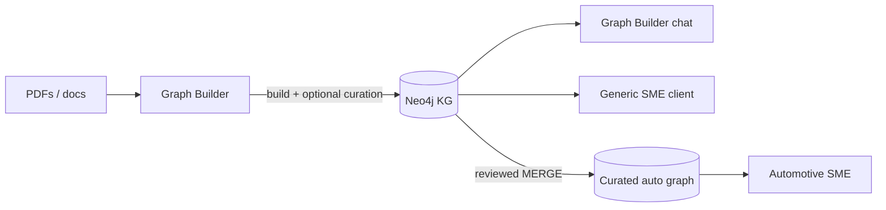

# SME apps, knowledge graphs, and curation

Product architecture notes for how **PDF Graph Builder**, a **generic SME chat client**, and **domain-specific SME** (e.g. automotive) relate. Captures decisions from design discussion—not implementation specs.

**Related docs:**

- [../design.md](../design.md) — local Graph Builder deployment and PDF ingest pipeline
- [Neo4j-AutoMechanic-SME docs/DESIGN.md](../../Neo4j-AutoMechanic-SME/docs/DESIGN.md) — automotive diagnostic SME (current)

---

## The three-piece split

| Piece | Role | Domain |
|---|---|---|
| **pdf-graph-builder** (Graph Builder) | Ingest documents → chunks + embeddings + LLM-extracted entities → Neo4j | **Agnostic** (schema optional in UI) |
| **Generic SME** (future) | Expert **chat** over whatever KG it connects to | **Set by the graph**, not hard-coded in the app |
| **Auto Mechanic SME** (existing) | Expert chat on a **curated diagnostic** graph | **Automotive** (schema, seed, prompts, fallbacks) |



**Build** in Graph Builder (or hand-seed / ETL). **Ask** in an SME-style client. **Curate** during build or in a review step—not in the read-only chat path.

---

## Graph Builder: build the KG

Graph Builder is the **factory** for document-derived knowledge graphs:

- Upload → chunk → embed → Ollama entity extraction → Neo4j
- Optional extraction schema (structure vs activity labels)
- Built-in chat (vector / graph / hybrid) for exploration

It is **domain-agnostic by design**. The corpus and schema you choose give it a “flavour,” not the application name or repo.

See [../design.md](../design.md) for the local ingest pipeline.

---

## Domain-specific SME (what exists today)

[Neo4j-AutoMechanic-SME](../../Neo4j-AutoMechanic-SME) is **not** “SME for whatever KG you point at.” It is a **diagnostic troubleshooting app** with automotive knowledge baked into the code:

| Layer | Automotive-specific? |
|---|---|
| Neo4j connection (URI, user, password, database) | No — configurable |
| Seed graph (`Component`, `Symptom`, `DiagnosticCode`, …) | Yes |
| Cypher agent prompts | Yes — “auto mechanics”, fixed path shapes |
| Fallback queries | Yes — hardcoded labels and relationships |
| UI / persona (Rex) | Yes |
| PDF ingest (`ingest_pdf.py`) | Yes — optional RAG chunks in SME DB |

**Primary question it answers:**

> *I have a symptom, code, or failure—what should I check, what might be wrong, and how do I fix it?*

Pointing today’s SME at a Graph Builder database (e.g. `pdfgraphbuilder`) **without code changes** would fail or produce nonsense: extracted labels (`Person`, `Organization`, …) do not match `Component` / `CAN_CAUSE` / etc.

---

## Generic SME: the KG sets the domain

A **generic SME** is feasible as a **separate, thin product**:

> Answer questions as an expert using the structured graph (and optional document chunks) in the Neo4j database you connect to.

**Domain lives in the graph**, not in application code:

- Automotive manual → automotive-flavoured answers
- Legal corpus → legal-flavoured answers
- Same app, different `NEO4J_DATABASE` and different curated content

### What a generic SME would do

1. Connect via Bolt (URI, credentials, database name).
2. **Introspect schema** (APOC / `db.schema`) or accept light config (excluded labels, persona text).
3. **Text → Cypher** using schema in the prompt.
4. Execute read queries; synthesize a grounded answer (cite nodes/chunks when possible).
5. **Optional hybrid RAG** if `Document` / `Chunk` and a vector index exist.
6. **Graceful failure** when the graph cannot support the question—not in-app graph repair.

### What it would not do (v1)

- PDF upload or extraction (Graph Builder’s job)
- Hand-authored seed data in the repo
- Hard-coded vertical labels (`Component`, `Symptom`, …)
- Merge, dedup, or relabel nodes (curation—see below)

### Overlap with Graph Builder chat

Graph Builder already provides **generic chat** on ingested data. A dedicated generic SME only makes sense if you want:

| | Graph Builder | Generic SME |
|---|---|---|
| Primary UX | Ingest, schema, visualization, Bloom | **Chat-first**, minimal UI |
| Stack | Heavy (React + FastAPI) | Thin (e.g. FastAPI + simple front end) |
| Runtime | Same machine as builder | **Consumer** of KGs built elsewhere |
| Persona | Product default | Configurable neutral “SME” tone |

**Rule of thumb:** tune and explore in Graph Builder; **productize Q&A** in generic SME when you want a small, dedicated expert client.

### Hard parts

- **Schema heterogeneity** — LLM-extracted graphs are messy; curated graphs are stable. Prompts and fallbacks must tolerate both.
- **No universal diagnostic path** — automotive fallbacks do not generalize; fallbacks must be schema-driven or omitted.
- **Quality follows the KG** — generic SME exposes graph quality; it does not fix it in chat.

---

## Curation: where it belongs

**Curation** is making the graph **trustworthy enough to query**: schema choice, deduplication, dropping bad triples, merging into a stable ontology, provenance, human review.

### Curation belongs upstream (build time)

| Activity | Where |
|---|---|
| Extraction schema in UI | Graph Builder |
| Review / edit extracted graph | Graph Builder UI, Neo4j Browser, Bloom |
| Entity resolution, MERGE into curated labels | ETL scripts, manual Cypher, future tooling |
| Decide what promotes to a product graph (e.g. auto diagnostic DB) | Human review + scripts |

### Generic SME does **not** need curation in the client

If curation happens while **building** the KG, the SME client should **trust and read** the result:

```
Build + curate  →  Graph Builder (+ review / MERGE)
Ask             →  Generic SME (read-only expert chat)
```

The SME may still have **guardrails** (not curation):

| In SME? | Example |
|---|---|
| No | Edit nodes, merge duplicates, change labels |
| No | Re-run extraction or change schema |
| Yes | “Insufficient data in the graph to answer” |
| Yes | Show sources (nodes, chunks, properties) |
| Yes | Read-only queries (no writes) |

Optional **admin** tools later (flag node, delete bad fact) are not the main SME path and not required for v1.

**If curation leaks into the SME app**, you maintain two places to fix bad data and two overlapping UIs. Avoid that.

---

## PDF ingest and SME

Today’s automotive SME includes **PDF → chunk → embed → `Document` nodes** (RAG only; no entity graph). Graph Builder does **chunk + embed + entity extraction**.

### Direction: remove PDF ingest from SME

**Pros**

- Clear separation: Graph Builder = documents; SME = query curated graph
- No duplicate chunk stores or embedding models
- Protects diagnostic graph from unreviewed uploads
- Simpler SME codebase

**Cons**

- Loses one-app “upload manual and ask” until a bridge exists
- Hybrid “graph + manual detail” in SME requires chunks to live in (or be synced to) the DB SME queries
- No automated MERGE from `pdfgraphbuilder` → SME `neo4j` yet

**Pragmatic sequence**

1. Do document work in Graph Builder (`pdfgraphbuilder` DB).
2. Remove or de-emphasize SME ingest when ready.
3. Define **promotion**: reviewed triples (and optionally chunks) into the SME database—not blind merge of all LLM output.

**Middle ground:** remove ingest from the **SME UI/API**, but allow SME to **read** `Document`/`Chunk` data loaded by a shared pipeline or ETL from Graph Builder.

---

## Promoting Graph Builder output to a product graph

Graph Builder and automotive SME use **separate Neo4j databases** on purpose (avoid `Document`/chunk collisions and label noise).

A future bridge might look like:

```
pdfgraphbuilder (extracted, exploratory)
        │
        │  human review + MERGE / ETL
        ▼
neo4j (curated diagnostic schema)  ←  Auto SME queries here
```

Only facts you would **sign off on** should enter the product graph—not everything the LLM extracted.

---

## Recommended product line

| Repo / app | Keep as |
|---|---|
| **pdf-graph-builder** | Domain-agnostic KG factory + exploration |
| **Generic SME** (future) | Thin read-only expert chat; KG sets domain |
| **Neo4j-AutoMechanic-SME** | Vertical **template**: curated auto schema + persona + seed; optional fork for other verticals |

Automotive SME is a **reference implementation of the activity/diagnostic pattern**, not the platform. Generic SME is the **platform shell**. Graph Builder is the **document-to-KG pipeline**.

---

## Open decisions

- [ ] Name and repo for generic SME (e.g. `neo4j-kg-chat`)
- [ ] Remove PDF ingest from automotive SME (timing vs promotion pipeline)
- [ ] First promotion rules: auto diagnostic schema mapping from extracted labels
- [ ] Whether generic SME v1 includes vector RAG or graph-only Cypher first

---

## One-line summary

**Graph Builder builds and curates the KG; generic SME reads whatever graph it is pointed at (domain = graph content); automotive SME remains an optional vertical with schema and persona in code—not a substitute for a flavourless client.**
